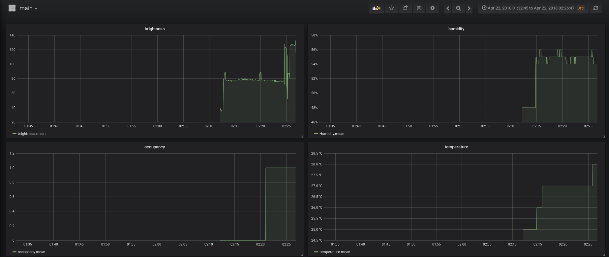

Introduction
============

The internet of things (IoT) is a concept that defines the possibility
of internet connected objects and the interaction between them.

This project is about gathering humidity, temperature, occupancy and
light intensity data from sensors connected to NodeMcu device. The data
gathered from the device is transferred to an online MQTT broker then
stored on Influxdb and displayed on Grafana.

Nodemcu programming
===================

Device and tools
----------------

### NodeMcu

NodeMcu is an open-source firmware and development kit. NodeMcu is low
cost and WI-FI enabled (using ESP8266) , it integrates GPIO, PWM, IIC,
1-wire and ADC.


The NodeMcu board is programmed with Arduino framework using PlatformIO
IDE .

### Sensors

Building this IoT node required 3 types of sensors:

-   DHT11 humidity and temperature sensor.

-   Photo-resistor as a light intensity sensor.

-   Button as an occupancy sensor.


 


 


After gathering all the sensors, now we connect them to the board’s pins
which number is sufficient for operating all the sensors mentioned
above.


### PlatformIO IDE

Platformio IDE is an open-source integrated development environment for
IoT. It supports more than 400 embedded boards , 20 development
platforms and 10 frameworks. In this project we will be using PlatformIO
with Atom which is Github’s text editor.


Data gathering
--------------

### Humidity and Temperature

    #include <ESP8266WiFi.h>
    #include <Adafruit_Sensor.h>
    #include <DHT.h>
    #include <DHT_U.h>

    #define DHTPIN            2       

    #define DHTTYPE           DHT11   

    DHT_Unified dht(DHTPIN, DHTTYPE);

    uint32_t delayMS;

    void setup() {
      Serial.begin(9600); 
      // Initialize device.
      dht.begin();
      sensor_t sensor;
      delayMS = sensor.min_delay / 1000;
    }

    void loop() {
      // Delay between measurements.
      delay(delayMS);
      // Get temperature event and print its value.
      sensors_event_t event;  
      dht.temperature().getEvent(&event);
      if (isnan(event.temperature)) {
        Serial.println("Error reading temperature!");
      }
      else {
        Serial.print("Temperature: ");
        Serial.print(event.temperature);
        Serial.println(" *C");
      }
      // Get humidity event and print its value.
      dht.humidity().getEvent(&event);
      if (isnan(event.relative_humidity)) {
        Serial.println("Error reading humidity!");
      }
      else {
        Serial.print("Humidity: ");
        Serial.print(event.relative_humidity);
        Serial.println("%");
      }
    }
        

### Occupancy

    #include <ESP8266WiFi.h>
    bool a = false;  
    int switchPin = 14;  
    void occupancy()
        {
         a = !a ;

        }
    void setup(){
        Serial.begin();}
    void loop(){
        if (digitalRead(switchPin)){
        occupancy();
        Serial.print(a)};
        }
        

### Brightness

    #include <ESP8266WiFi.h>
    void setup(){}
        
    int light(){
            int sensorValue = analogRead(A0);
            return sensorValue;
            }
    void loop(){
            Serial.print(light());
            }
        

OTA compatibility
-----------------

Over-the-air (OTA) programming is used in this project to update the
firmware of the device. This method is very useful in case of limited or
no physical access to the device.

OTA may be done using:

-   through the IDE

-   Web browser

-   HTTP Server

The OTA method I chose for this project is via Web browser , I think
that this method is user-friendly.

        
    #include <ESP8266WiFi.h>
    #include <WiFiClient.h>
    #include <ESP8266WebServer.h>
    #include <ESP8266mDNS.h>
    #include <ESP8266HTTPUpdateServer.h>

    const char* host = "esp8266-webupdate";
    const char* ssid = "........";
    const char* password = "........";

    ESP8266WebServer httpServer(80);
    ESP8266HTTPUpdateServer httpUpdater;

    void setup(void) {

      Serial.begin(115200);
      Serial.println();
      Serial.println("Booting Sketch...");
      WiFi.mode(WIFI_AP_STA);
      WiFi.begin(ssid, password);

      while (WiFi.waitForConnectResult() != WL_CONNECTED) {
        WiFi.begin(ssid, password);
        Serial.println("WiFi failed, retrying.");
      }

      MDNS.begin(host);

      httpUpdater.setup(&httpServer);
      httpServer.begin();

      MDNS.addService("http", "tcp", 80);
      Serial.printf("Open http://esp8266-webupdate.local/update \n");
    }

    void loop(void) {
      httpServer.handleClient();
    }


        

After uploading this firmware with USB serial , the device is going to
connect to the WIFI hotspot and boot sketch , after that it is possible
to update the firmware through the URL:
`http://esp8266-webupdate.local/update` .


[fig:firmware]

Data transferring
-----------------

The data gathered from sensors is transferred with MQTT (Message Queuing
Telemetry Transport) which is a publish-subscribe messaging protocol.

Nodemcu is compatible with 3.1.1 version of MQTT .

The messages published will be json objects where data values , time
(UTC) and device name will be published. I used a public MQTT broker
which is HiveMQ , link: `http://www.hivemq.com/demos/websocket-client/`


[fig:json]

To send the time of data collected I needed to get the time in UTC. The
device send an NTP packet to a time server : `time.nist.gov` and receive
time in UNIX timestamp epoch. It proceeds then to converting it to UTC.

You will find the complete NodeMcu code in this Github repository:

`https://github.com/houssemsioud/iotanode.git`

InfluxDB Database
=================

InfluxDB is an open source Time Series Database with no external
dependencies. It’s useful for recording metrics, events, and performing
analytics.I installed InfluxDb on Kali Linux OS .

I chose InfluxDB because of it’s compatibility with Grafana : Grafana
allows easily gathering data from InfluxDB.

InfluxDB setup
--------------

For installing InfluxDB on Ubuntu OS run this commands:

    curl -sL https://repos.influxdata.com/influxdb.key | sudo apt-key add -
    source /etc/lsb-release
    echo "deb https://repos.influxdata.com/

    ${DISTRIB_ID,,} ${DISTRIB_CODENAME} stable" |

     sudo tee /etc/apt/sources.list.d/influxdb.list
        

And then to install ad start InfluxDB service :

    sudo apt-get update && sudo apt-get install influxdb
    sudo service influxdb start
        


[fig:Influx1]

Data storing
------------

To create our first data base it is simple , we run this commands :

``` {.bash language="bash"}
> create database temperature
    
```

And to show existing databases:

``` {.bash language="bash"}
> show databases
    
```


[fig:Influx2]

Once we have created databases for temperature , humidity, occupancy and
brightness ,we need to make a python script that:

-   connects to the MQTT broker

-   subscribes to the topics

-   saves values received in InfluxDB

<!-- -->

    import paho.mqtt.client as paho
    import simplejson as json
    from influxdb import InfluxDBClient

    #Setup some constants with InfluxDB Host and Database name
    INFLUXDB_HOST = 'localhost'
    INFLUXDB1_NAME = 'temperature_data'
    INFLUXDB2_NAME = 'humidity_data'
    INFLUXDB3_NAME = 'occupancy_data'
    INFLUXDB4_NAME = 'light_data'

    db1client = InfluxDBClient(INFLUXDB_HOST,'8086','','',INFLUXDB1_NAME)
    db2client = InfluxDBClient(INFLUXDB_HOST,'8086','','',INFLUXDB2_NAME)
    db3client = InfluxDBClient(INFLUXDB_HOST,'8086','','',INFLUXDB3_NAME)
    db4client = InfluxDBClient(INFLUXDB_HOST,'8086','','',INFLUXDB4_NAME)


    #Query Existing Values
    result = db1client.query('SELECT * FROM temperature')
    points = list(result.get_points(measurement='temperature'))
    for point in points: 
       print('station = ',point['station'],'value = ',point['value'])


    def on_subscribe(client, userdata, mid, granted_qos):
        print("Subscribed: "+str(mid)+" "+str(granted_qos))
     
    def on_message(client, userdata, msg):

        d=json.loads(str(msg.payload))
        json_data=[d]
        print(json_data)
        if d["measurement"] == "temperature":
            bResult = db1client.write_points(json_data)
        elif d["measurement"] == "Humidity":
            bResult = db2client.write_points(json_data)
        elif d["measurement"] == "occupancy":
            bResult = db3client.write_points(json_data)
        elif d["measurement"] == "brightness":
            bResult = db4client.write_points(json_data)


      
    client = paho.Client()
    client.on_subscribe = on_subscribe
    client.on_message = on_message
    client.connect('broker.mqttdashboard.com', 1883)
    client.subscribe('0079/#', qos=0)

    client.loop_forever()
         


[fig:python]

Now the data is being saved to the database , we only need now to
visualize the data in Grafana.

Data monitoring with Grafana
============================

Grafana is an open source, feature rich metrics dashboard and graph
editor for Graphite, Elasticsearch, OpenTSDB, Prometheus and
**InfluxDB**. Grafana offers the possibility to customize the data
visualization dashboard with multiples preferences and plugins.

Grafana setup
-------------

Installing Grafana on Kali Linux is very easy , run this commends :

    wget https://s3-us-west-2.amazonaws.com/grafana-releases/
    release/grafana_5.0.4_amd64.deb
    sudo apt-get install -y adduser libfontconfig
    sudo dpkg -i grafana_5.0.4_amd64.deb
        

To start grafana server just run :

    systemctl start grafana-server
        

Now go to your browser and enter this URL : `http://localhost:3000/`.

You should now log in Grafana with admin/admin. We will start now
configuring Grafana to link with InfluDB as a data source:

-   Choose InfluxDB as a data source

-   Name the data source

-   Put HTTP url as : http://localhost:8086

-   Put the name of the DB we created in InfluxDB

Now we will see the data source added to Grafana.


[fig:grafana1]

Data display
------------

After adding the data sources to Grafana now we need to display the
values n our dashboard , for that we create a new dashboard , we select
grapf as a new panel .

Now we have a raw graph panel, we just need to configure the data source
and the value to show . After setting all the graphs we get a dashboard
looking like this.

 [fig:grafana2]

Stresstesting NodeMcu
=====================

Limit Bauderate for communication
---------------------------------

Bauderate is bits/sec , in serial communication we send 10 bits words at
a time . After testing different bauderates for the communication we can
verify that the maximum bauderate regarding nodemcu is 9600 when using
10 ms delay (960 characters/s), 115200 when using 1 ms (11520
characters/s) delay and 250000 when using $40 \mu s$ delay (25000
characters/s) .

When trying to send faster or more characters , the serial buffer will
get filled as it can hold up to 63 characters.

Realibility of OTA
------------------

Over the air update uses 50% of the space available in NodeMcu as it
needs to have the old firmware available in the memory for a future
update. NodeMcu maximum program storage space is 1MB ( with 3MB SPIFFS
), so we will be able only to use 50% if we proceed to OTA .


[fig:nodem]

Some problems are encountered when using sketches of 49% or 50% , it’s
preferable if the sketch doesn’t exceed 48% of maximum program size when
using OTA.

Conclusion
==========

In this project we created an IOT node that can read tempeture ,
humidity , occupancy and light intensity values using NodeMcu device and
multiple sensors.

The device NodeMcu is enabled for OTA programming through web server
which simplifies the update of the firmware.

The data were transferred to the database via Json over MQTT using
Hivemq public broker where a python script subscribes to the topics and
sends the data to InfluxDB Database.

Grafana is used to display the data in form of charts using InfluxDB .
The challenges:

-   Learning about InfluxDB database .

-   Choosing the right MQTT broker for the project.

-   Getting real time from server and formatting it to UTC iso format.

-   Finding the documents for the different sensors.

So what can be done to improve this project ?

-   Adding more sensors to the node : wind speed, air quality, sound
    level..

-   Creating a mother board containing the microprocessor and all the
    sensors.

-   Creating a protecting package for the node.

-   Using a private MQTT broker and securing the data.

-   Using different technology (ie. LORA )


